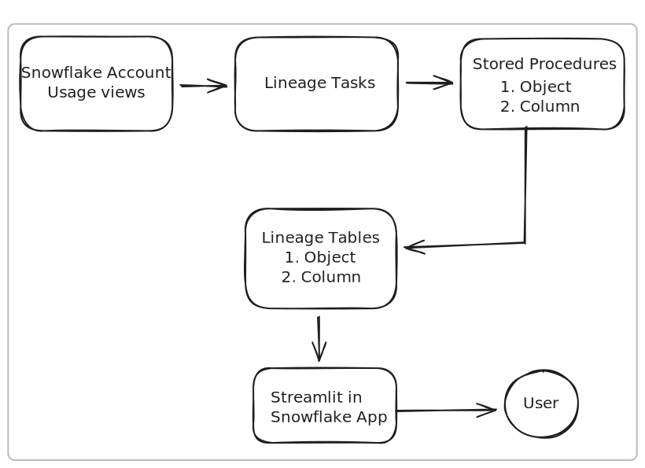

# Snowflake-Native Data Lineage Framework

## System Design



This framework provides a robust and cost-effective solution for capturing, storing, and querying object and column-level data lineage within Snowflake. It is designed to be fully native to Snowflake, using features available in 2024, and is optimized for high-volume environments.

## Overview

The framework automatically captures data lineage information from Snowflake's `ACCOUNT_USAGE` schema and stores it in a log-based model. This approach is highly efficient and avoids complex and costly transformations, making it suitable for environments with millions of daily queries.

### Key Features

-   **Object-Level Lineage:** Tracks dependencies between tables, views, and other database objects.
-   **Column-Level Lineage:** Provides detailed lineage from a source column to a target column.
-   **Time Travel:** Allows querying lineage at any specific point in time.
-   **Forward & Backward Lineage:** Supports tracing lineage from source to target (downstream) and from target to source (upstream).
-   **Cost-Efficient:** Optimized for performance and low credit consumption in high-volume environments.
-   **Snowflake-Native:** Built entirely on Snowflake SQL, procedures, and tasks.

## Architecture

The framework is built upon the following components:

1.  **Lineage Tables (`LINEAGE_OBJECT`, `LINEAGE_COLUMN`):** These tables store the lineage information as an append-only log. This design is simple, performant, and allows for powerful time-travel queries.

2.  **Stored Procedures (`POPULATE_LINEAGE_OBJECT`, `POPULATE_LINEAGE_COLUMN`):** These procedures contain the logic to extract lineage data from Snowflake's `ACCESS_HISTORY` view and insert it into the lineage tables.

3.  **Snowflake Tasks (`LINEAGE_ROOT_TASK`, `LINEAGE_OBJECT_TASK`, `LINEAGE_COLUMN_TASK`):** A tree of tasks automates the lineage capture process. A root task runs on a schedule (default: 60 minutes) and triggers the object and column lineage population tasks.

## Setup

To deploy the lineage framework, follow these steps:

1.  **Run the DDL Script:** Execute the script in `ddl/lineage_tables.sql` to create the necessary schema and tables.

    ```sql
    -- Run contents of ddl/lineage_tables.sql
    ```

2.  **Create the Stored Procedures:** Execute the scripts in `dml/populate_lineage_object.sql` and `dml/populate_lineage_column.sql` to create the data population procedures.

    ```sql
    -- Run contents of dml/populate_lineage_object.sql
    -- Run contents of dml/populate_lineage_column.sql
    ```

3.  **Configure and Create the Tasks:** Open `tasks/lineage_tasks.sql`, replace the placeholder `'COMPUTE_WH'` with a warehouse of your choice, and then execute the script.

    ```sql
    -- Modify and run contents of tasks/lineage_tasks.sql
    ```

4.  **Resume the Root Task:** The tasks are created in a suspended state. You only need to resume the root task to start the automated lineage capture.

    ```sql
    ALTER TASK LINEAGE.LINEAGE_ROOT_TASK RESUME;
    ```

## Usage

You can query the `LINEAGE_OBJECT` and `LINEAGE_COLUMN` tables to explore the data lineage.

### Example 1: Backward Lineage (Upstream) for a Table

To find all tables that are direct sources for `MY_DB.MY_SCHEMA.MY_TABLE`:

```sql
SELECT DISTINCT SOURCE_OBJECT_NAME
FROM LINEAGE.LINEAGE_OBJECT
WHERE TARGET_OBJECT_NAME = 'MY_DB.MY_SCHEMA.MY_TABLE';
```

### Example 2: Forward Lineage (Downstream) for a Table

To find all tables that are directly populated from `MY_DB.MY_SCHEMA.MY_TABLE`:

```sql
SELECT DISTINCT TARGET_OBJECT_NAME
FROM LINEAGE.LINEAGE_OBJECT
WHERE SOURCE_OBJECT_NAME = 'MY_DB.MY_SCHEMA.MY_TABLE';
```

### Example 3: Column Lineage for a specific column

To find the direct source columns for `MY_DB.MY_SCHEMA.MY_TABLE.MY_COLUMN`:

```sql
SELECT DISTINCT SOURCE_OBJECT_NAME, SOURCE_COLUMN_NAME
FROM LINEAGE.LINEAGE_COLUMN
WHERE TARGET_OBJECT_NAME = 'MY_DB.MY_SCHEMA.MY_TABLE'
  AND TARGET_COLUMN_NAME = 'MY_COLUMN';
```

### Example 4: Time Travel Query

To get the lineage for `MY_DB.MY_SCHEMA.MY_TABLE` as it was on January 1st, 2024:

```sql
WITH lineage_at_time AS (
    SELECT *,
           ROW_NUMBER() OVER(PARTITION BY SOURCE_OBJECT_NAME, TARGET_OBJECT_NAME ORDER BY QUERY_START_TIME DESC) as rn
    FROM LINEAGE.LINEAGE_OBJECT
    WHERE QUERY_START_TIME <= '2024-01-01'::TIMESTAMP_LTZ
)
SELECT SOURCE_OBJECT_NAME, TARGET_OBJECT_NAME, QUERY_ID, QUERY_START_TIME
FROM lineage_at_time
WHERE rn = 1
  AND TARGET_OBJECT_NAME = 'MY_DB.MY_SCHEMA.MY_TABLE';
```

### Example 5: Multi-level Backward Lineage using a Recursive CTE

To trace the full upstream lineage for a table:

```sql
WITH RECURSIVE backward_lineage (target, source, level) AS (
    -- Anchor member: direct sources of the starting table
    SELECT TARGET_OBJECT_NAME, SOURCE_OBJECT_NAME, 1
    FROM LINEAGE.LINEAGE_OBJECT
    WHERE TARGET_OBJECT_NAME = 'MY_DB.MY_SCHEMA.MY_TARGET_TABLE'

    UNION ALL

    -- Recursive member: join back to the lineage table
    SELECT l.TARGET_OBJECT_NAME, l.SOURCE_OBJECT_NAME, bl.level + 1
    FROM LINEAGE.LINEAGE_OBJECT l
    JOIN backward_lineage bl ON l.TARGET_OBJECT_NAME = bl.source
)
SELECT DISTINCT source, level
FROM backward_lineage
ORDER BY level;
```

## Lineage Visualization with Streamlit in Snowflake

This framework includes a Streamlit application designed to run natively within Snowflake, providing a secure and convenient way to visualize the lineage data.

### Deploying the Streamlit App in Snowflake

1.  **Run the Setup Script:**
    Execute the SQL commands in `streamlit_app/setup.sql`. This will create a `STREAMLIT` object and a stage (`lineage_app_stage`) for the application files. Make sure to replace `'COMPUTE_WH'` with your desired warehouse.

2.  **Upload Application Files to the Stage:**
    Upload the `app.py` and `environment.yml` files from the `streamlit_app` directory to the `lineage_app_stage` you created. You can do this using the Snowflake UI (by navigating to the stage and clicking "Upload") or by using SnowSQL.

    **Using SnowSQL:**
    ```bash
    # Navigate to the streamlit_app directory first
    cd data-governance/sf-lineage-framework/streamlit_app

    # Connect to SnowSQL, then run the PUT commands
    snowsql -c your_connection_name -q "PUT file://app.py @lineage_app_stage;"
    snowsql -c your_connection_name -q "PUT file://environment.yml @lineage_app_stage;"
    ```

3.  **Access the Application:**
    Navigate to the "Streamlit" section in the Snowflake UI. You should see your `LINEAGE_APP` application. Click on it to open the lineage visualizer. The app will use your active Snowflake session, so no additional credential configuration is needed.
